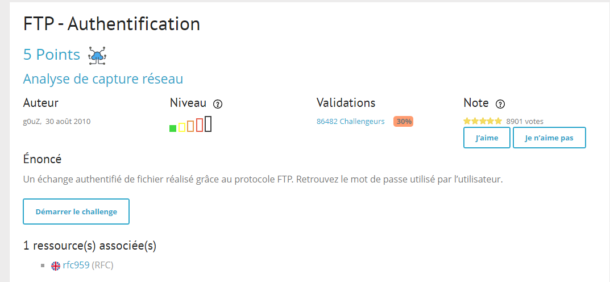
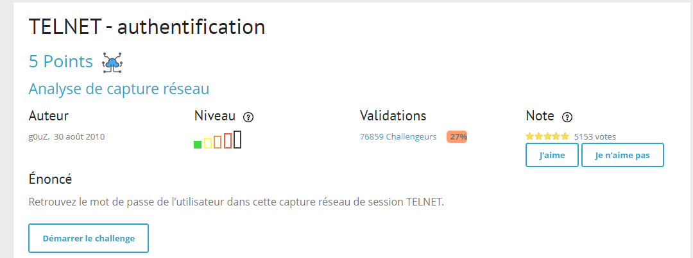
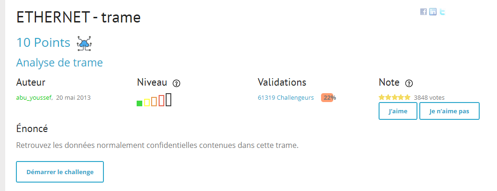
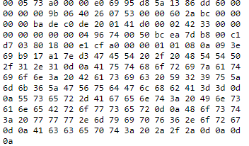
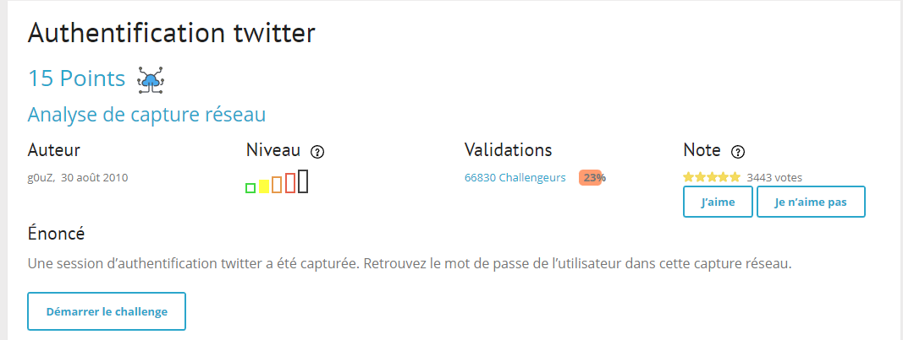
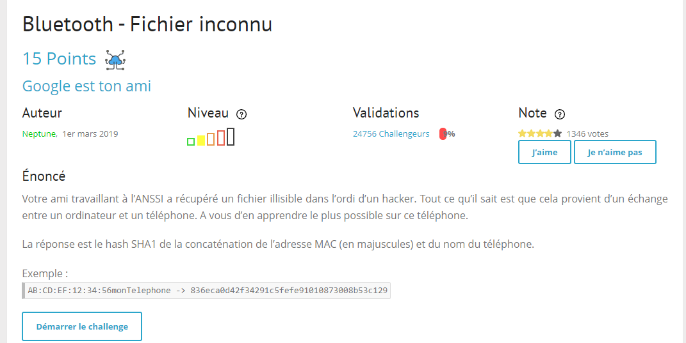

# CHALLENGE n°1: FTP authentification
## Subject

1. Copier le lien du bouton "démarrer le challenge" et l'ouvrir dans un onglet qui va télécharger un fichier `ch1.pcap`
2. Ouvrir ce fichier sur `wireshark`
3. Filtrer sur la barre de recherche `FTP`
4. Rechercher sur la colonne info `request:USER`
5. Suivre et puis retrouver le mot de passe et copier le pour passer à l'étape suivante
&nbsp;
.png)
&nbsp;
# CHALLENGE n°2: TELNET authentification
## Subject

1.  Copier le lien du bouton "démarrer le challenge" et l'ouvrir dans un onglet qui va télécharger un fichier `ch2.pcap`
2. Ouvrir ce fichier sur `wireshark`
3. Filter sur la barre de recherche `TELNET`
4. Rechercher sur la colonne info `Telnet Data... [Malformed packet]`
5. Suivre et puis retrouver le mot de passe et copier le pour passer à l'étape suivante
&nbsp;
# CHALLENGE n°3: ETHERNET TRAME authentification
## Subject

1. Copier le lien du bouton "démarrer le challenge" et l'ouvrir dans un onglet qui va ouvrir un fichier `txt`
2. Décoder le texte puis copier le mot de passe pour accéder au challenge suivant

&nbsp;
# CHALLENGE n°4: Authentification-Twitter
## Subject

1.  Copier le lien du bouton "démarrer le challenge" et l'ouvrir dans un onglet qui va télécharger un fichier `ch2.pcap`
2. Ouvrir ce fichier sur `wireshark`
3. Vous trouverez une suele ligne avec le protocole `HTTP`
4. Suivre puis vous allez trouver un mot de passe encodé, il suffira de le décoder pour passer au challenge suivant
.png)
&nbsp;
# CHALLENGE n°5: Bluetooth-fichier inconnu
## Subject

1.  Copier le lien du bouton "démarrer le challenge" et l'ouvrir dans un onglet qui va télécharger un fichier `ch18.txt`
2. Ouvrir ce fichier sur `wireshark`
3. Ouvrir la section `wireless` sur la barre d'outil et cliquer sur `Equipement bluetooth`
.png)
4. Vous trouverez l'adresse MAC et le nom du téléphone et vous n'aurez plus qu'à suivre l'instruction du sujet